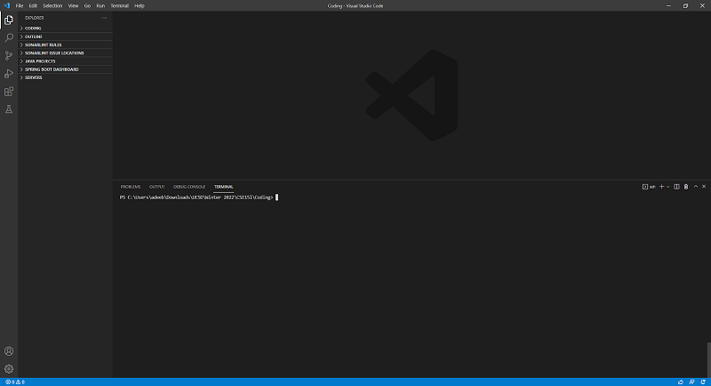

# HOW TO LOG INTO A COURSE-SPECIFIC ACCOUNT ON IENG6

## Installing VScode
1. Head to the website [Visual Studio Code](https://code.visualstudio.com/)

    

2. Proceed through installation
3. Make sure you can open VScode and see this screen

    

4. Congrats you're done!

---
## Remotely Connecting
1. Install [OpenSSH](https://docs.microsoft.com/en-us/windows-server/administration/openssh/openssh_install_firstuse) through **PowerShell and follow the steps exactly**.
2. Once done you will now be able to ```ssh``` into the CS lab machines
    
    ### Utilizing SSH ###
    Since we have VScode installed, you can use its built in terminal by pressing **[CTRL]+[`]**. To SSH simply type
    
         ssh cs15lwi22zz@ieng6.ucsd.edu
    >Make sure you replace zz with your appropriate CSE15L account
    
    >You can look that up at [SDACS](https://sdacs.ucsd.edu/~icc/index.php)
    
    You should see a message like this

        ssh cs15lwi22zz@ieng6.ucsd.edu
        The authenticity of host 'ieng6.ucsd.edu (128.54.70.227)' can't be established.
        RSA key fingerprint is SHA256:ksruYwhnYH+sySHnHAtLUHngrPEyZTDl/1x99wUQcec.
        Are you sure you want to continue connecting (yes/no/[fingerprint])?
    >Just type **yes**

    

    Now when you connect you'll see all the info of your previous successful and failed logins.
    You'll also get some handy server info like CPU usage.

    Success you can now SSH into the school's labs!

---
## Trying Some Commands
There are some commands for a terminal that are important to learn. Here are the basics that can be used and their descriptions:
* cd ~
>Takes you back to your home directory.
* cd <directory>
>Allows you to traverse through directories.
* cd ..
>Used to move back directories.
* ls -lat
>Provides useful specifics of your current directories files.
* ls -a
>Lists all files in current directory.
* ls <directory>
>Will diplay the files within given directory.
* cp <file> <directory>
>Copies a file to a direcotry; try using -r to force a file copy.
* vim <file>
>A built in text editor within the terminal


To exit the ```SSH``` terminal type **quit** or **[CTRL]+[D]**

Now you're an expert in traversing a terminal!

---
## Moving Files with ```scp```
Let's say you want to move a file over from your local machine to the ssh machine. The ```scp``` command allows for such a thing.

    scp <file> cs15lwi22zz@ieng6.ucsd.edu:~/
>Replace the **zz** with your specifi account and this will copy your local file to the home directory of the ssh account.

---
## Setting an SSH Key
Doesn't it get boring constantly having to input your password? Let's set up an SSH key so you no longer have that issue.

Type out:

    ssh-keygen
>It will ask you certain questions, to default them just hit **[ENTER]**

Now that you have your keys go into your ssh machine. So we can create a new file called **.ssh**.

    $ ssh cs15lwi22zz@ieng6.ucsd.edu
    <Enter Password>
    $ mkdir .ssh
    $ exit
    $ scp /Users/joe/.ssh/id_rsa.pub cs15lwi22@ieng6.ucsd.edu:~/.ssh/authorized_keys
>Make sure you use your course specific account.

Now you should be able to log-in without your password like this:


Congrats!

---
## Optimizing Remote Running
#### Just some useful tips and tricks. ####
* Running commands on the ssh server from your local machine. To do this type:

    ssh cs15lwi22@ieng6.ucsd.edu <command>
>Use your course specific account. This will output whatever command your ran without having to jup into your ssh machine and then run it.

* Compiling and running code the same way. To do this type:

    ssh cs15lwi22zz@ieng6.ucsd.edu "javac <file.java>; java <file.java>"
>This will both compile and run your code without having to enter your ssh machine.


Fin! You're now all caught up and looking great!
