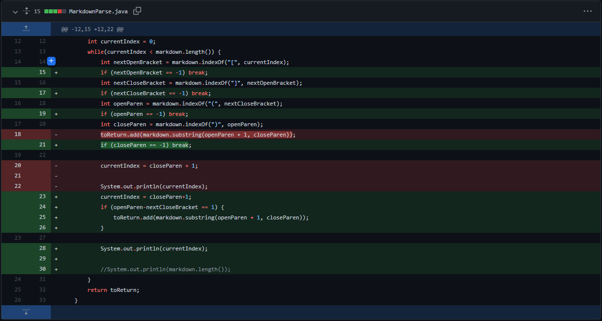
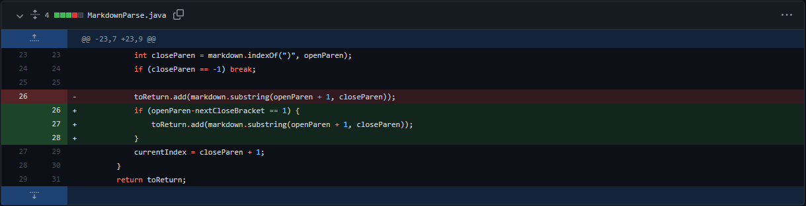
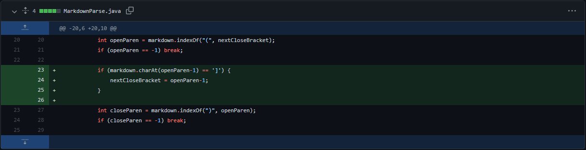

# Fixing Bugs

## Fix1:



[Testfile](https://github.com/Aziiz0/markdown-parse/blob/main/test-file1.md)

```
PS C:\Users\adeeb\Documents\GitHub\markdown-parse> javac MarkdownParse.java
PS C:\Users\adeeb\Documents\GitHub\markdown-parse> java MarkdownParse.java test-file1.md
PS C:\Users\adeeb\Documents\GitHub\markdown-parse>
```

>The starting code had a noticable bug when you would input any character at the end. This would cuase an infinite loop. This was because the while loop would never finish since the closing bracket would not be found and be set equal to -1 which is less than the maximus size of the file.


---

## Fix2:



[Testfile](https://github.com/Aziiz0/markdown-parse/blob/main/test-file2.md)

```
PS C:\Users\adeeb\Documents\GitHub\markdown-parse> javac MarkdownParse.java
PS C:\Users\adeeb\Documents\GitHub\markdown-parse> java MarkdownParse.java test-file2.md
[https://something.com, some-page.html, google.com]
PS C:\Users\adeeb\Documents\GitHub\markdown-parse>
```

>The next bug was where a link could be out of syntax. This would cause the code to take in links when it should not have. The error came from not checking the distance between the closing bracket and open parenthesis.


---

## Fix3:



[Testfile](https://github.com/Aziiz0/markdown-parse/blob/main/test-file3.md)

```
PS C:\Users\adeeb\Documents\GitHub\markdown-parse> javac MarkdownParse.java
PS C:\Users\adeeb\Documents\GitHub\markdown-parse> java MarkdownParse.java test-file3.md
[https://something.com, some-page.html]
PS C:\Users\adeeb\Documents\GitHub\markdown-parse>
```

>The next bug was where you could not have brackets inside of your brackets. This caused the code to not be able to detect a link. This was due to the closing bracket being looked at after the first open bracket. Then since we have multiple brackets within the link bracket the open parenthesis and closed bracket distance will not equal 1.
