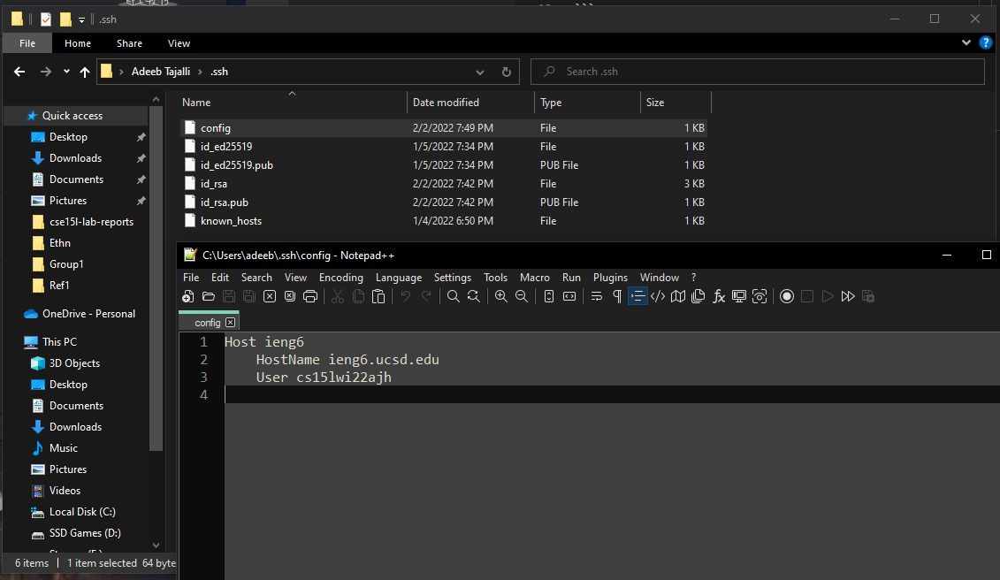

# Streamlining ssh Configuration

## Show your .ssh/config file, and how you edited it (with VScode, another program, etc):



>Implementing the config file for ssh-ing into a machine was pretty simple. In my case the config file did not exist so I had to create one within the .ssh folder. Then you use the format dispplayed wehre you create some host alias name and assing its server path and your personall user name for that server.

---

## Show the ssh command logging you into your account using just the alias you chose.:


>Finally I dont have to either spend the time typing out my full username and trying to remember what the exact strings were, or looking through the history to find the last time I ssh-ed to re-use the command.

---

## Show an scp command copying a file to your account using just the alias you chose.:


>I noticed that we cannot simply type in ```scp [file] ieng6``` to scp a file over to the server. You have to specify a path given with :~/ which is the home directory for the account. 
