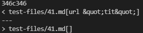
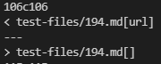

# Week 10 Lab Report

## Markdown-Parse Repository links:
- [My Repository](https://github.com/Aziiz0/markdown-parse-Fireflies)
- [Lab 9 Implementation](https://github.com/ucsd-cse15l-w22/markdown-parse)

---

|Tests| Differences |
|--------|----------|
| 41.md  ||
| 194.md ||

## Explain:

### How you found the tests with different results (Did you use diff on the results of running a bash for loop? Did you search through manually? Did you use some other programmatic idea?)
> When we got both codes to output into a separate text file of each tests, we were able to use the command ```diff markdown-parse-Fireflies/results.txt markdown-parse/results.txt``` to find the differences between each output. This allowed us to see the given differences in our two selected tests given above.

### For each test:

- ### Describe which implementation is correct, or if you think neither is correct, by showing both actual outputs and indicating what the expected output is.

> We found for test 41.md that our code is incorrect while Joe's code was correct. The contents of 41.md were
>        
>       [a](url &quot;tit&quot;)
>        
> which github.com was giving us no links corresponding. Hence our output ```url &quot;tit&quot;]``` was wrong.

> We found for test 194.md that both Joe's and our code were wrong. The contents of 194.md were 
>
>       [Foo*bar\]]:my_(url) 'title (with parens)'
>       [Foo*bar\]]
>
> which github.com was giving us the link ```[my_(url)]```.  Hence our output of ```[url]``` was almost correct.

- ### For the implementation that’s not correct (or choose one if both are incorrect), describe the _bug (the problem in the code). You don’t have to provide a fix, but you should be specific about what is wrong with the program, and show the code that should be fixed.

> I will be choosing 41.md the analyse. The output should have been no links. Our code was pretty linear so it grabbed what was inside the parenthesis without seeing ```&quot;tit&quot;``` as being some kindof formatting for quoting the string tilt. To fix this we could directly search for formats of these kinds. This could go after each collection of open parenthesis as a string to check weather ```&quot;``` is inside it. If so then we would not add the link to the list.